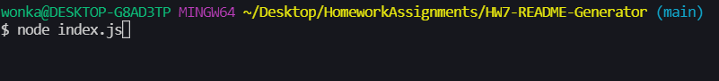
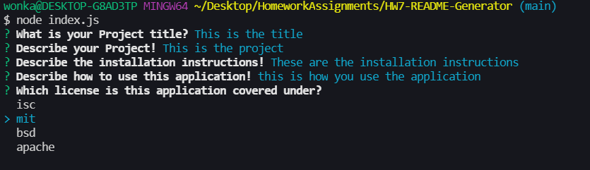
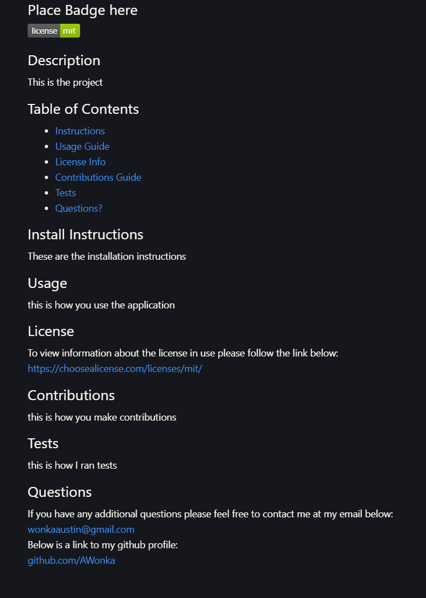

# HW7-README-Generator

## How to use

When using this README Generator you must start by typing node index.js

After you type that you will see a series of prompts asking questions, answer each of these questions and you will generate your README file.

## Generated README

Once you have answered every prompt and generated the README you will find a file named "generatedREADME.md". This is where you will find your generated README. You will have the title of the project at the top, followed by the license badge, description of the project, table of contents, installation instructions, how to use the application, license information, how to make contributions, what tests you ran, and how to reach out to you if the user has any further questions.

